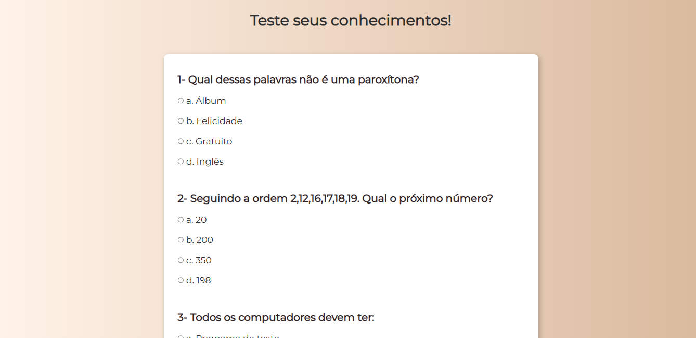

# Desafios de Conhecimentos!

## Sobre o Projeto:

O projeto Max Point é um formulário de preenchimento obrigatório com validações JavaScript, para ter acesso ao quiz.
O quiz consiste em 5 questões de múltipla escolha e tem como objetivo testar seus conhecimentos do usuário. 

## Como utilizar o quiz:

Para ter obter o resultado do quiz, o usuário obrigatóriamente precisa selecionar uma das alternativa de cada questão para concluir o teste.

## Link do projeto:

https://thmenezes.github.io/Desafios-de-conhecimentos/

## Tecnologias utilizadas:

## Autora: 

  https://github.com/ThMenezes

